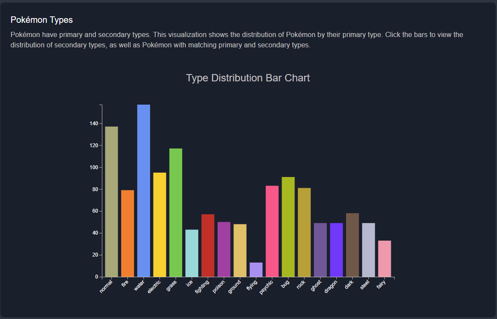

# ECS 163 Final Project
## Overview

This project is a data storytelling website built with React and D3.js that aims to visualize trends in competitive Pokémon battling across Smogon (Singles) and VGC (Doubles) formats from 2022 to 2024. We use the **Martini Glass** structure to guide users through the basic concepts and introduce the metagame to the user. By the end of the exploration of the competitive metas, users will have the opportunity to use an exploratory approach and create their competitive team using the dedicated team builder.

## Objectives
- Provide interactive visualizations to reveal competitive trends, statistical outliers, and type synergies
- Help users discover viable team compositions via a Team Builder and Weaknesses Calculator, along with a radar comparison chart
- Support Users at **all skill levels** with guided explanations and dynamic comparisons.

---
## Visualizations
| Component | Description |
|----------|-------------|
| **Type Distribution Bar Chart** | Explore the primary and secondary type frequency of Pokémon. |
| **Type Effectiveness Heatmap** | View how each attacking type interacts with all type combinations for a chosen primary type. |
| **Stat Overview Histogram** | Select from HP, Attack, Speed, etc., and view Pokémon stat distributions along with explanations. |
| **Streamgraph** | Examine changes in usage of Pokémon types across generations and tournament formats. |
| **Team Builder Assistant** | Add up to 6 Pokémon and see your team’s weaknesses and resistances. |
| **Radar Chart Comparison** | Compare two Pokémon’s base stats side-by-side with dynamic scaling. |

### Type Distribution Bar Chart


---
## Dataset

- Source: [Kaggle – Pokémon Competitive Usage (Smogon and VGCWorlds)](https://www.kaggle.com/datasets/danielsmdev/pokemon-competitive-usage-smogon-and-vcgworlds)
- Contents: Pokémon names, types, base stats, usage rates across multiple years and formats.
- In the /data file, it includes additional data from the [Smogen Index](https://www.smogon.com/stats/)

---
## Technologies Used

| Tool / Library | Purpose |
|----------------|---------|
| **React + TypeScript** | Frontend framework |
| **D3.js** | Data visualizations |
| **Vite** | Build tool and dev server |
| **MUI (Material UI)** | UI components |
| **Sprites** | Pokémon icons from [Pokémon Showdown](https://play.pokemonshowdown.com/) |

---


## Installation and Setup
1. **Clone the Repository**
    ```bash
    git clone https://github.com/YOUR-TEAM-HERE/pokemon-competitive-visualization.git
    cd pokemon-competitive-visualization
    ```
2. **Install Dependencies**:
    In your terminal, run this to install nvm
    ```bash
    curl -o- https://raw.githubusercontent.com/nvm-sh/nvm/v0.40.3/install.sh | bash
    ```
    or this if your running windows
    ```bash
    wget -qO- https://raw.githubusercontent.com/nvm-sh/nvm/v0.40.3/install.sh | bash
    ```
    Now lets download latest release of node:
     ```bash
    nvm install node # "node" is an alias for the latest version
     ```
3. **Demo**
   
    Run the following:
    ```bash
    npm install
    ```
    Start the development server with:
    ```bash
    npm run dev
    ```
    
## **Team**
| Team Member       | Contributions                                                                                      |
|-------------------|----------------------------------------------------------------------------------------------------|
| **Megan Liu**     | Implemented the Type Distribution Bar Chart and contributed to the final UI layout and integration. |
| **Travis Liang**  | Developed the Type Heatmap, Stat Distribution Histogram, Team Builder Assistant, Team Carousel, and resolved conflicts during merge |
| **Sean Singleton**| Created the Team Builder, Team Weakness Calculator, optimized the Radar Chart, and finalized the dashboard. |
| **Shaoke Qi**     | Implemented the first version of the Radar Chart and built the Streamgraph visualization.           |
| **Zhaoqian Wang** | Processed and cleaned dataset.       |
    

